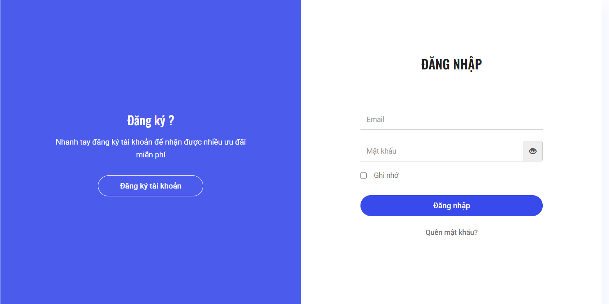
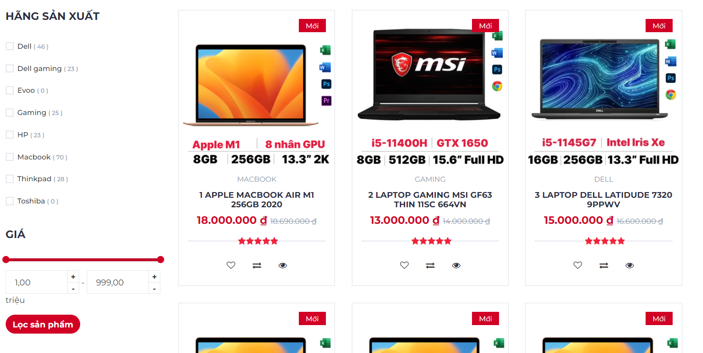

# Chi tiết về dự án
- Mục đích xây dựng: Hiểu sâu hơn về cách hoạt động cơ bản của 1 website và các ngôn ngữ liên quan, thư viện liên quan
- Công nghệ sử dụng: 
    - Back-end: Java 8, Jsp/Servlet
    - Front-end: Html/Css, Bootstrap 4, Javascript, Jquery
    - Database: MySql
- Link youtube giới thiệu chi tiết về trang web: https://youtu.be/a59CAjawRFA
- Một số hình ảnh về trang web
    - Đối với trang khách hàng
    

    

    

    

    

    
    - Đối với admin
    
    
    
    
    - Lưu ý: Đây chỉ là một số hình ảnh demo, còn rất nhiều hình ảnh khác
##### Bản quyền bởi HuaDuy 2023
    
